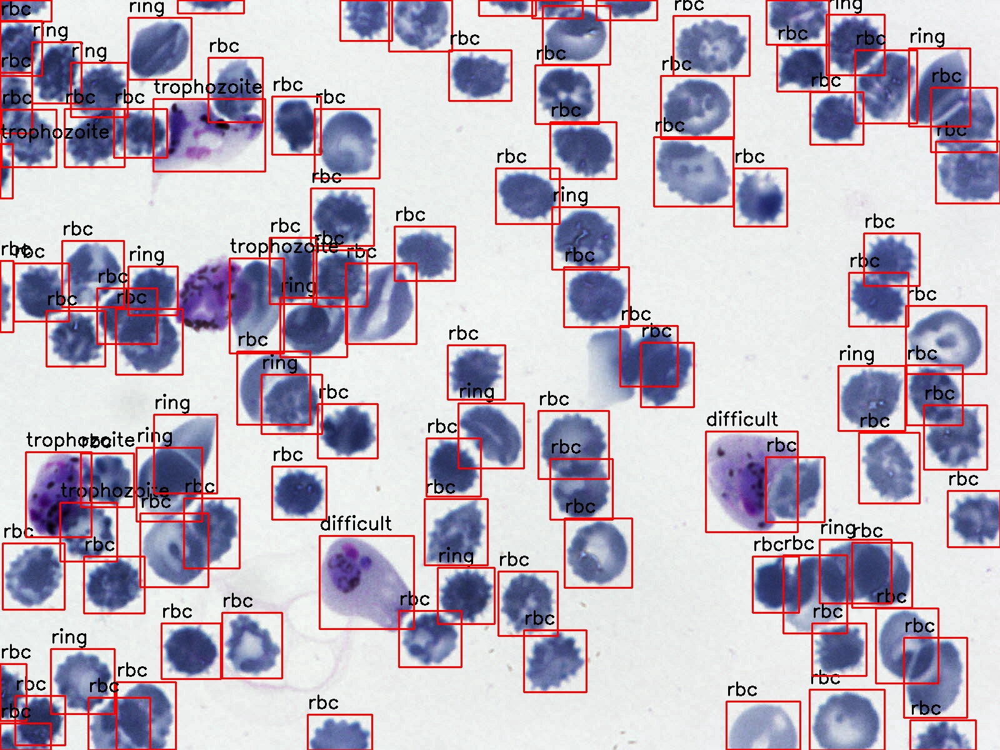

# Malaria Infected Cell Localization and Classification Project
This project implements a pipeline for cell localization and classification using YOLOv7 and ResNet18. The YOLOv7 model is used for detecting and localizing cells in images, while the ResNet18 model is fine-tuned for classifying the localized cells into specific categories.
---

## Features
- **Cell Localization**: YOLOv7 is employed to detect and crop cells from images.
- **Cell Classification**: A fine-tuned ResNet18 model classifies the cropped cells into predefined categories.

---
## Requirements
To run the project, ensure the following dependencies are installed:
```bash
pip install yolov7/requirements.txt
```

## For Inference
For inference, update the path of image in `inference_resyol.py` and run the script
```bash
python3 inference_resyol.py
```

## Sample Prediction
